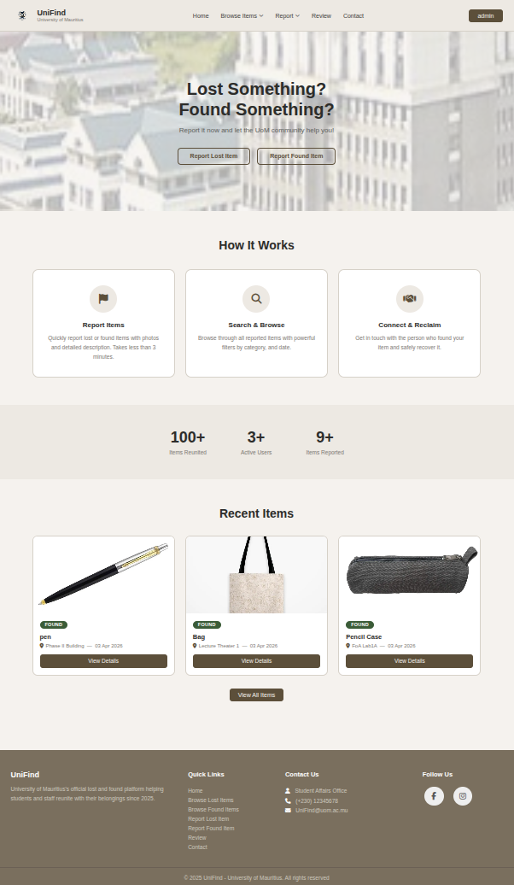
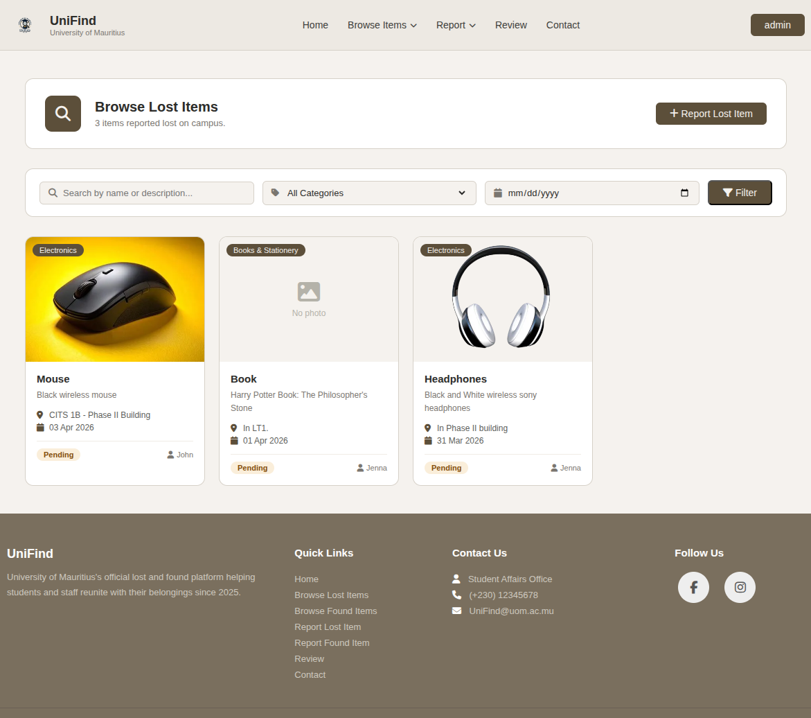
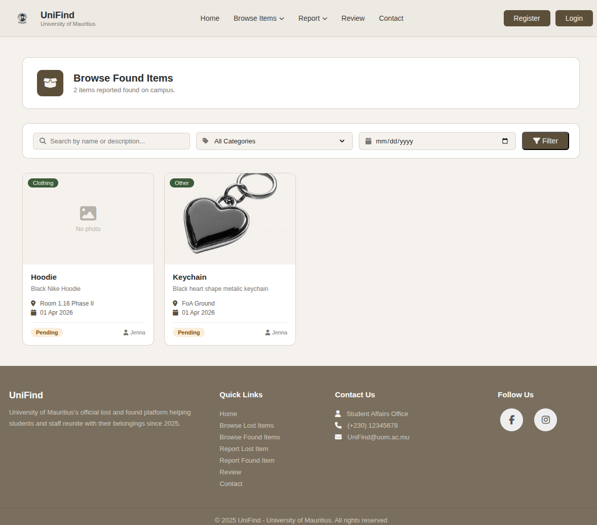
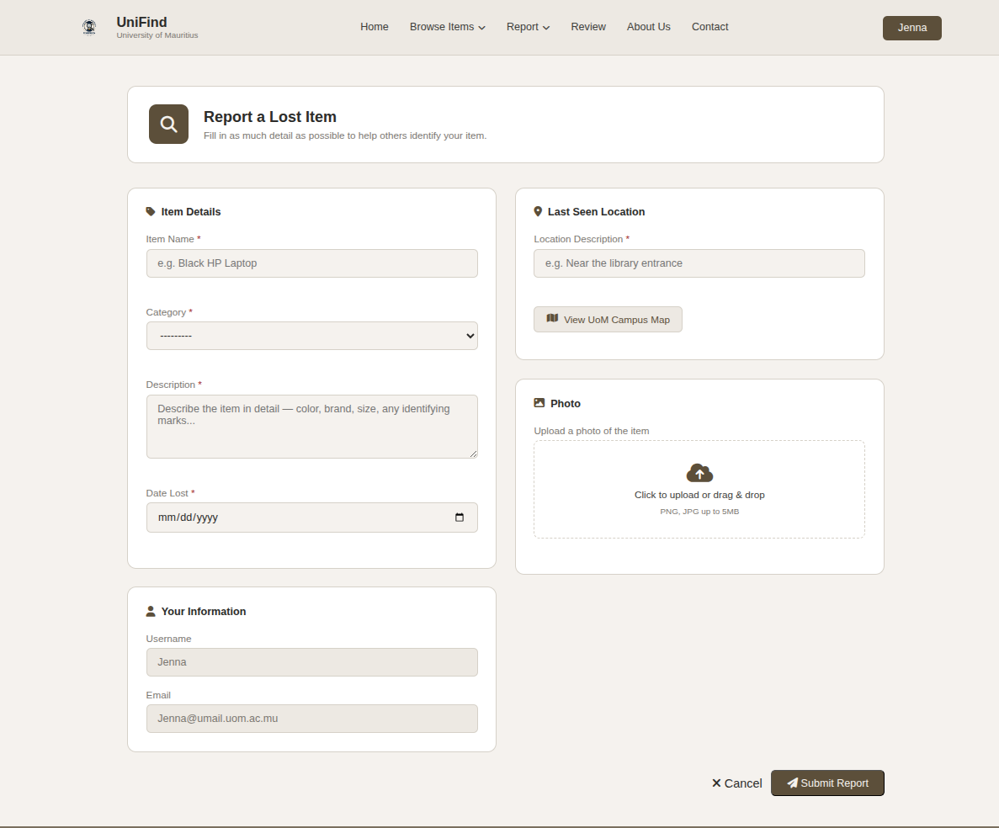
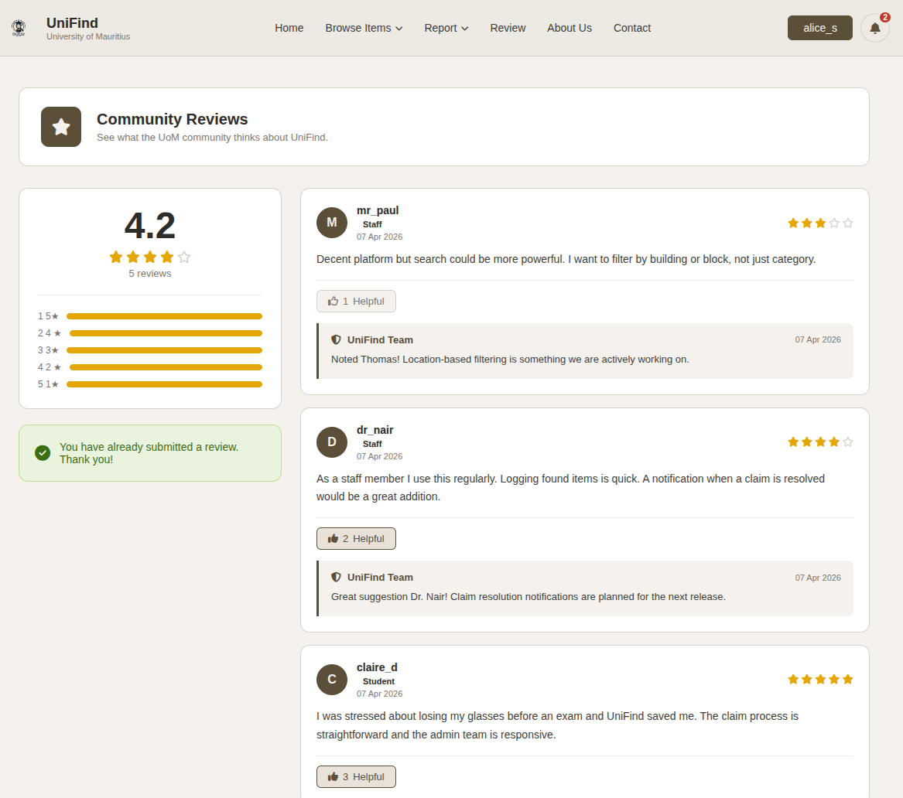

# UniFind – Lost & Found Management System
## Table of Contents

- [Overview](#overview)
- [Screenshots](#screenshots)
- [Features](#features)
- [Tech Stack](#tech-stack)
- [Project Structure](#project-structure)
- [Installation & Setup](#installation--setup)
- [API Endpoints](#api-endpoints)
- [Authentication APIs](#authentication-apis-jwt)
- [Lost & Found APIs](#lost--found-apis)
- [Review System](#review-system)
- [Contact System](#contact-system)
- [Router Configuration](#router-configuration)
- [Media Handling](#media-handling)
- [Inspiration](#inspiration)

## Overview

**UniFind** is a full-stack Lost & Found management system designed to help UoM students and staff report, search, and recover lost or found items efficiently.

The system provides a **RESTful API** built with Django REST Framework, allowing seamless integration with web or mobile frontends.

## Screenshots

### Home Page



### Lost Items Page



### Found Items Page



### Report Item Form



### Review Page



## Features

### User Features

* Register and manage user profiles
* Report **lost items**
* Report **found items**
* Browse all lost and found items
* Contact system
* Leave reviews and feedback

### Admin Features

* Manage lost & found listings
* Respond to user messages
* Moderate reviews and replies

### API Features

* Fully RESTful endpoints with JSON responses
* **JWT Authentication** for secure access
* CRUD operations for:

  * Lost Items
  * Found Items
  * Contact Messages
  * Reviews & Replies
  * Users

## Tech Stack

* **Backend:** Django
* **API:** Django REST Framework
* **Authentication:** JWT (JSON Web Tokens)
* **Database:** SQLite
* **Media Handling:** Pillow

## Project Structure

```
UniFind/
│── UniFind/
│   ├── settings.py
│   ├── urls.py
│
│── core/
│   ├── models.py
│   ├── views.py
│   ├── serializers.py
│   ├── forms.py
│   ├── urls.py
│
│── media/
│── db.sqlite3
│── manage.py
```

## Installation & Setup

### Clone the Repository

```bash
git clone https://github.com/Jenna-LHW/UniFind.git
cd unifind
```

### Create Virtual Environment

```bash
python -m venv venv
source venv/bin/activate   # Linux / Mac
venv\Scripts\activate      # Windows
```

### Install Dependencies

```bash
pip install -r requirements.txt
```

### Apply Migrations

```bash
python manage.py migrate
```

### Create Superuser

```bash
python manage.py createsuperuser
```

### Run Server

```bash
python manage.py runserver
```

## API Endpoints

### Base URL

```
http://127.0.0.1:8000/api/
```

## Authentication APIs (JWT)

| Endpoint          | Method | Description                   |
| ----------------- | ------ | ----------------------------- |
| `/auth/register/` | POST   | Register a new user           |
| `/auth/login/`    | POST   | Obtain access & refresh token |
| `/auth/refresh/`  | POST   | Refresh access token          |
| `/auth/user/`     | GET    | Get logged-in user profile    |

### Example Payload

```json
{
  "username": "your_username",
  "password": "your_password"
}
```

### Auth Header

```
Authorization: Bearer <access_token>
```

## Lost & Found APIs

### Lost Items

| Method | Endpoint       | Description         |
| ------ | -------------- | ------------------- |
| POST   | `/lost-items/` | Report lost item    |
| GET    | `/lost-items/` | View all lost items |

```json
{
  "item_name": "Wallet",
  "category": "Personal",
  "description": "Black leather wallet",
  "last_seen": "Library",
  "date_lost": "2026-03-20",
  "user": 1
}
```

### Found Items

| Method | Endpoint        | Description          |
| ------ | --------------- | -------------------- |
| POST   | `/found-items/` | Report found item    |
| GET    | `/found-items/` | View all found items |

```json
{
  "item_name": "Phone",
  "category": "Electronics",
  "description": "iPhone with cracked screen",
  "found_at": "Cafeteria",
  "date_found": "2026-03-22",
  "user": 1
}
```

## Review System

| Method | Endpoint            | Description       |
| ------ | ------------------- | ----------------- |
| GET    | `/reviews/`         | Get all reviews   |
| POST   | `/reviews/`         | Create review     |
| GET    | `/reviews/replies/` | Get admin replies |

```json
{
  "rating": 5,
  "comment": "Great platform!",
  "user": 1
}
```

## Contact System

| Method | Endpoint     | Description      |
| ------ | ------------ | ---------------- |
| GET    | `/contacts/` | Get all messages |
| POST   | `/contacts/` | Send message     |

```json
{
  "name": "John Doe",
  "email": "john@email.com",
  "subject": "Lost Item Help",
  "message": "I need help finding my item."
}
```

## Router Configuration

```python
router.register(r'lost-items', LostItemViewSet)
router.register(r'found-items', FoundItemViewSet)
router.register(r'contacts', ContactMessageViewSet)
router.register(r'reviews', ReviewViewSet)
router.register(r'review-replies', ReviewReplyViewSet)
```

## Media Handling

* Uploaded images are stored in `/media/`

```python
MEDIA_URL = '/media/'
MEDIA_ROOT = os.path.join(BASE_DIR, 'media')
```

## Inspiration

Adapted from a **group university assignment** for the Web and Mobile Development module at UoM.
