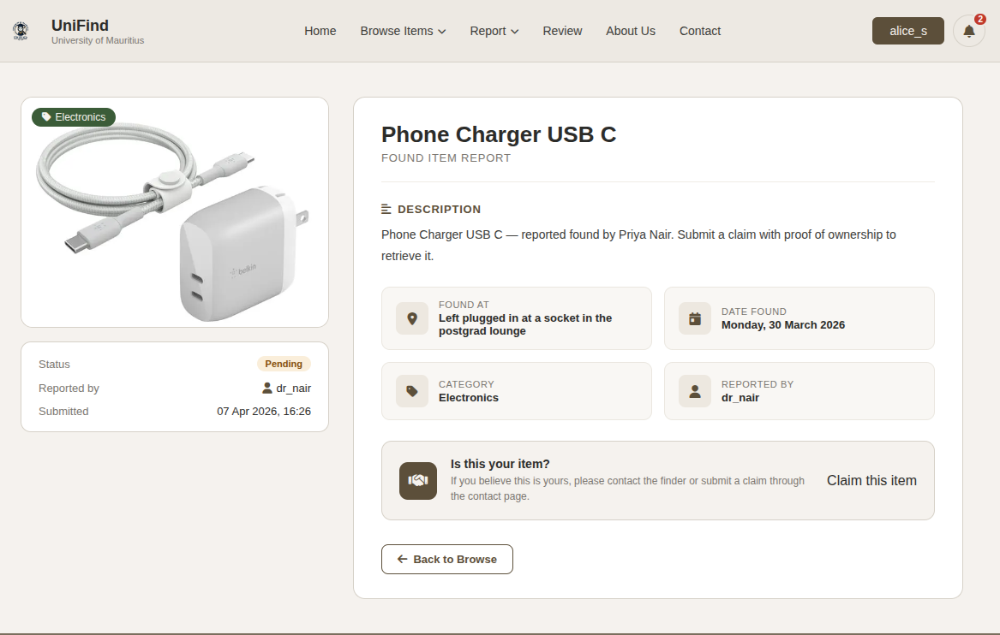
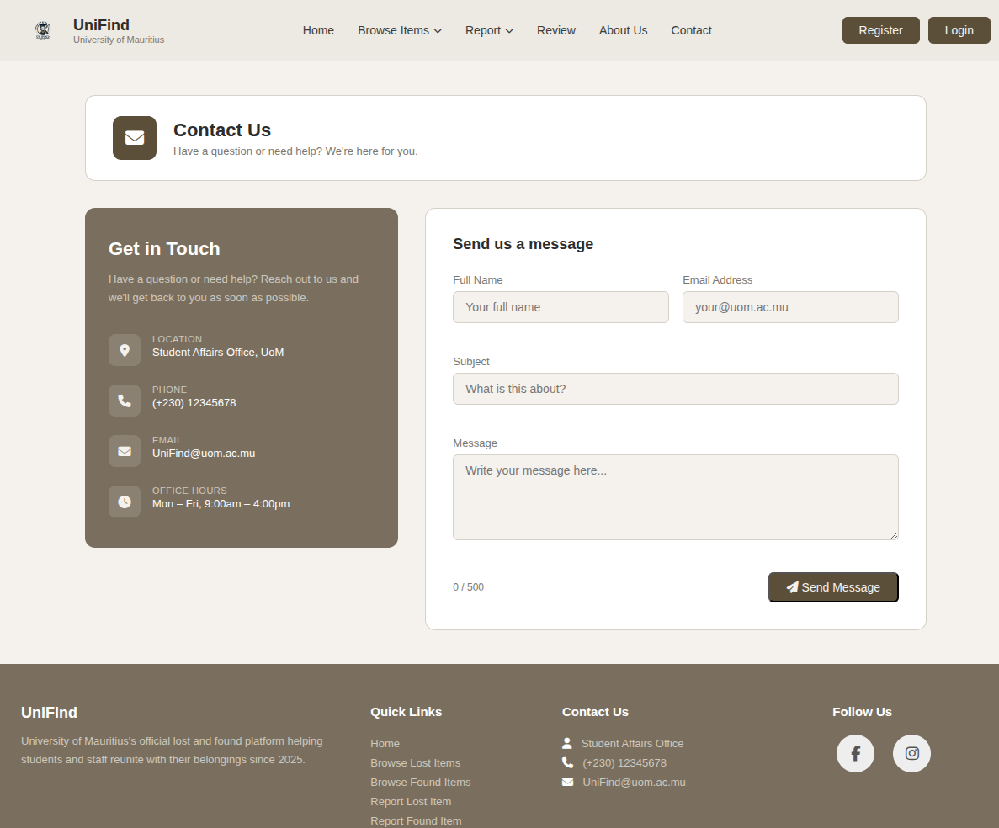
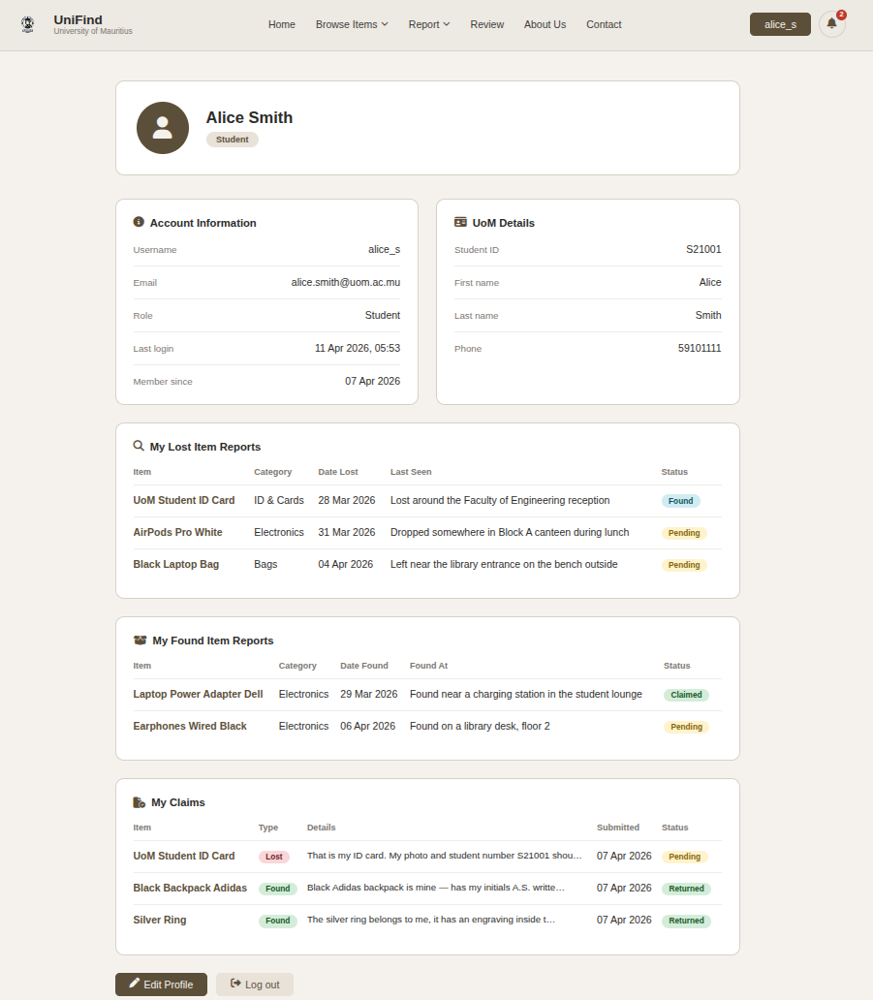
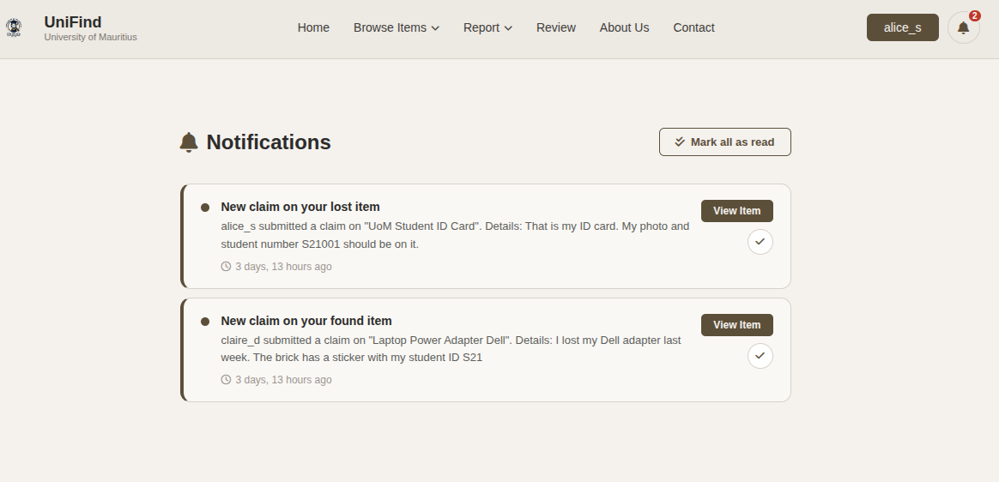
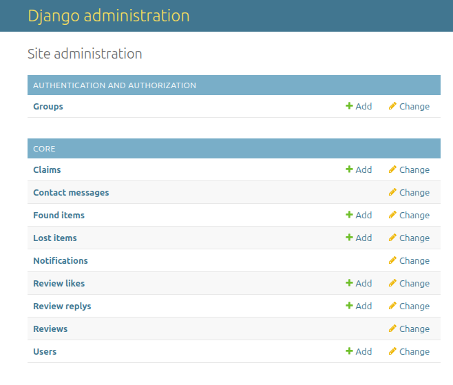

# UniFind – Lost & Found Management System

## Table of Contents

- [Overview](#overview)
- [Demo](#demo)
- [Screenshots](#screenshots)
- [Features](#features)
- [Request, Claim & Recovery Flow](#request-claim--recovery-flow)
- [Tech Stack](#tech-stack)
- [Project Structure](#project-structure)
- [Installation & Setup](#installation--setup)
- [API Endpoints](#api-endpoints)
  - [Authentication APIs](#authentication-apis-jwt)
  - [Lost & Found APIs](#lost--found-apis)
  - [Claims API](#claims-api)
  - [Notifications API](#notifications-api)
  - [Review System](#review-system)
  - [Contact System](#contact-system)
- [Router Configuration](#router-configuration)
- [Media Handling](#media-handling)
- [Future Improvements](#future-improvements)
- [Inspiration](#inspiration)

---

## Overview

**UniFind** is a full-stack Lost & Found management system designed to help UoM students and staff report, search, and recover lost or found items efficiently.

The platform provides a structured, admin-assisted recovery process with secure and verified item claims, a real-time notification system, a review system with likes and admin replies, and role-based access control for students, staff, and admins.

The system exposes a RESTful API built with Django REST Framework, with JWT authentication, enabling easy integration with web or mobile applications.

---

## Demo

Watch the demo: https://www.youtube.com/watch?v=TUS9zCClP84 

---

## Screenshots

### Home Page


### Lost Items Page


### Found Items Page


### Item Details Page


### Report Item Form


### Review Page


### Contact Page


### Profile Page


### Notifications Page


### Admin Page


---

## Features

### User Features

* Register with a UoM email address (`@uom.ac.mu`) and select a role (Student or Staff)
* Manage and edit your user profile (name, phone, student ID)
* Report **lost items** with category, description, location, date, and optional photo
* Report **found items** with category, description, location, date, and optional photo
* Browse all lost and found listings with filtering by keyword, category, date, and status
* View detailed item pages and submit claims on lost or found items
* Track all your submitted claims and their statuses from your profile
* Receive **in-app notifications** when someone submits a claim on your item
* Mark notifications as read individually or all at once
* Leave a star-rated review with a comment (one review per user)
* Like or unlike other users' reviews
* Contact support via the contact form (pre-filled for logged-in users)
* Visit the About page for platform information and a campus map

### Admin Features

* Full Django admin panel access
* Manage all lost and found listings
* Review, approve, or reject submitted claims — automatically updating item status
* Reply to user reviews from the review page
* Ban or unban reviews (with an optional ban reason)
* Respond to contact messages
* View all claims submitted by all users

### API Features

* Fully RESTful endpoints with JSON responses
* **JWT Authentication** for secure access (register, login, refresh, user profile)
* **UoM email validation** on registration — only `@uom.ac.mu` addresses accepted
* Full CRUD operations on: Lost Items, Found Items, Claims, Notifications, Contact Messages, Reviews & Replies
* `?mine=true` query parameter on Lost and Found item endpoints to filter by the authenticated user
* Role-based access control: regular users manage their own data; admins see and manage everything
* `photo_url` field in Lost/Found item responses for direct media access

---

## Request, Claim & Recovery Flow

Users interact with items directly from the detail pages:

* **Lost item** → "I Found This Item" button
* **Found item** → "Claim This Item" button

When a claim is submitted:
1. The claimer provides supporting details to verify ownership or discovery
2. The item status is automatically updated (`pending` → `found` / `claimed`)
3. The item owner receives an **in-app notification** with a summary of the claim
4. An admin reviews the claim and approves (`returned`) or rejects it
5. On approval, the item status is updated to `resolved`
6. On rejection, the item status reverts to `pending`

Admin acts as the verified intermediary between both parties to ensure safe item recovery.

---

## Tech Stack

* **Backend:** Django
* **API:** Django REST Framework
* **Authentication:** JWT (via `djangorestframework-simplejwt`)
* **Database:** SQLite
* **Media Handling:** Pillow

---

## Project Structure

```
UniFind/
│── UniFind/
│   ├── settings.py
│   ├── urls.py
│
│── core/
│   ├── models.py
│   ├── views.py
│   ├── serializers.py
│   ├── forms.py
│   ├── urls.py
│   ├── admin.py
│   ├── context_processors.py
│   └── templates/core/
│       ├── base.html
│       ├── home.html
│       ├── about.html
│       ├── login.html
│       ├── register.html
│       ├── profile.html
│       ├── edit_profile.html
│       ├── report_lost.html
│       ├── report_found.html
│       ├── browse_lost.html
│       ├── browse_found.html
│       ├── lost_item_detail.html
│       ├── found_item_detail.html
│       ├── submit_claim.html
│       ├── review.html
│       ├── admin_reply.html
│       ├── notifications.html
│       └── contact.html
│
│── media/
│── db.sqlite3
│── manage.py
```

---

## Installation & Setup

### Clone the Repository

```bash
git clone https://github.com/Jenna-LHW/UniFind.git
cd UniFind
```

### Create Virtual Environment

```bash
python -m venv venv
source venv/bin/activate   # Linux / Mac
venv\Scripts\activate      # Windows
```

### Install Dependencies

```bash
pip install -r requirements.txt
```

### Apply Migrations

```bash
python manage.py migrate
```

### Create Superuser

```bash
python manage.py createsuperuser
```

### Run Server

```bash
python manage.py runserver
```

### Seed the Database (Optional)

UniFind includes a custom management command to populate the database with realistic demo data — users, lost and found items, claims, reviews, likes, admin replies, and contact messages.

```bash
# Seed with demo data
python manage.py seed

# Wipe all existing data and re-seed from scratch
python manage.py seed --clear
```

After seeding, the following demo accounts are available:

| Username     | Password      | Role    |
| ------------ | ------------- | ------- |
| `superadmin` | `Admin@1234`  | admin   |
| `alice_s`    | `Alice@1234`  | student |
| `ben_k`      | `Ben@1234`    | student |
| `claire_d`   | `Claire@1234` | student |
| `dr_nair`    | `Nair@1234`   | staff   |
| `mr_paul`    | `Paul@1234`   | staff   |

---

## API Endpoints

### Base URL

```
http://127.0.0.1:8000/api/
```

---

## Authentication APIs (JWT)

| Endpoint            | Method | Description                        |
| ------------------- | ------ | ---------------------------------- |
| `/auth/register/`   | POST   | Register a new user (UoM email only) |
| `/auth/login/`      | POST   | Obtain access & refresh tokens     |
| `/auth/refresh/`    | POST   | Refresh access token               |
| `/auth/user/`       | GET    | Get logged-in user profile         |

### Register Payload

```json
{
  "username": "your_username",
  "email": "your_email@uom.ac.mu",
  "password": "your_password",
  "role": "student",
  "student_id": "2100123",
  "phone": "5912345"
}
```

> **Note:** Only `@uom.ac.mu` email addresses are accepted. Each email can only be registered once.

### Auth Header

```
Authorization: Bearer <access_token>
```

---

## Lost & Found APIs

Both endpoints support a `?mine=true` query parameter to return only the authenticated user's items.

### Lost Items

| Method | Endpoint              | Description              |
| ------ | --------------------- | ------------------------ |
| GET    | `/lost-items/`        | View all lost items      |
| POST   | `/lost-items/`        | Report a lost item       |
| GET    | `/lost-items/<pk>/`   | Get a specific lost item |
| PUT    | `/lost-items/<pk>/`   | Update a lost item       |
| PATCH  | `/lost-items/<pk>/`   | Partially update         |
| DELETE | `/lost-items/<pk>/`   | Delete a lost item       |

```json
{
  "item_name": "Wallet",
  "category": "accessories",
  "description": "Black leather wallet with student ID inside",
  "last_seen": "Library – 2nd Floor",
  "date_lost": "2026-03-20",
  "photo": "<optional image file>"
}
```

**Categories:** `electronics`, `clothing`, `accessories`, `books_stationery`, `id_cards`, `bags`, `keys`, `other`

**Statuses:** `pending`, `found`, `resolved`

---

### Found Items

| Method | Endpoint               | Description               |
| ------ | ---------------------- | ------------------------- |
| GET    | `/found-items/`        | View all found items      |
| POST   | `/found-items/`        | Report a found item       |
| GET    | `/found-items/<pk>/`   | Get a specific found item |
| PUT    | `/found-items/<pk>/`   | Update a found item       |
| PATCH  | `/found-items/<pk>/`   | Partially update          |
| DELETE | `/found-items/<pk>/`   | Delete a found item       |

```json
{
  "item_name": "Phone",
  "category": "electronics",
  "description": "iPhone with cracked screen",
  "found_at": "Cafeteria",
  "date_found": "2026-03-22",
  "photo": "<optional image file>"
}
```

**Statuses:** `pending`, `claimed`, `resolved`

---

## Claims API

| Method | Endpoint          | Description                                  |
| ------ | ----------------- | -------------------------------------------- |
| GET    | `/claims/`        | List own claims (admins see all)             |
| POST   | `/claims/`        | Submit a new claim on a lost or found item   |
| GET    | `/claims/<pk>/`   | Get a specific claim                         |
| PUT    | `/claims/<pk>/`   | Update claim status (admin only)             |
| PATCH  | `/claims/<pk>/`   | Partially update claim status (admin only)   |
| DELETE | `/claims/<pk>/`   | Delete a claim (admin only)                  |

```json
{
  "lost_item": 3,
  "found_item": null,
  "details": "This is my wallet — it has my student ID card number 2100123 inside."
}
```

> A claim must reference either `lost_item` or `found_item`, not both.

**Statuses:** `pending`, `returned`, `rejected`

Submitting a claim automatically updates the linked item's status and triggers a notification to the item owner.

---

## Notifications API

| Method | Endpoint                              | Description                          |
| ------ | ------------------------------------- | ------------------------------------ |
| GET    | `/notifications/`                     | List all notifications for the user  |
| GET    | `/notifications/<pk>/`                | Get a specific notification          |
| PATCH  | `/notifications/<pk>/`                | Mark a notification as read          |
| POST   | `/notifications/mark-all-read/`       | Mark all notifications as read       |

Notifications are also accessible via the web UI at `/notifications/`.

---

## Review System

| Method | Endpoint              | Description                    |
| ------ | --------------------- | ------------------------------ |
| GET    | `/reviews/`           | Get all non-banned reviews     |
| POST   | `/reviews/`           | Submit a review (one per user) |
| GET    | `/reviews/<pk>/`      | Get a specific review          |
| PUT    | `/reviews/<pk>/`      | Update a review                |
| DELETE | `/reviews/<pk>/`      | Delete a review                |
| GET    | `/review-replies/`    | Get all admin replies          |

```json
{
  "rating": 5,
  "comment": "Found my lost wallet thanks to UniFind!"
}
```

Additional web-only review actions (require login):

| URL                                    | Description                         |
| -------------------------------------- | ----------------------------------- |
| `POST /review/<id>/like/`              | Toggle like on a review (AJAX)      |
| `POST /review/<id>/reply/`             | Admin: add or edit a reply          |
| `POST /review/<id>/ban/`               | Admin: ban or unban a review        |

---

## Contact System

| Method | Endpoint       | Description           |
| ------ | -------------- | --------------------- |
| GET    | `/contacts/`   | Get all messages      |
| POST   | `/contacts/`   | Send a contact message |

```json
{
  "name": "Jane Doe",
  "email": "jane@uom.ac.mu",
  "subject": "Help with a lost item",
  "message": "I reported a lost item last week but haven't heard back."
}
```

---

## Router Configuration

```python
router.register(r'lost-items',     LostItemViewSet)
router.register(r'found-items',    FoundItemViewSet)
router.register(r'contacts',       ContactMessageViewSet)
router.register(r'reviews',        ReviewViewSet)
router.register(r'review-replies', ReviewReplyViewSet)
router.register(r'claims',         ClaimViewSet,        basename='claim')
router.register(r'notifications',  NotificationViewSet, basename='notification')
```

---

## Media Handling

Uploaded photos are stored under `/media/` and served at `/media/<path>`. Serializers expose a `photo_url` field with the full URL for each image.

```python
MEDIA_URL  = '/media/'
MEDIA_ROOT = os.path.join(BASE_DIR, 'media')
```

---

## Future Improvements

- **Clickable Recent Items** — Make the items displayed in the Recent Items section on the home page clickable, linking directly to their respective lost or found item detail page
- **Interactive Map** — Replace the static campus map on the Report Lost/Found pages with a proper interactive map (e.g. Leaflet.js or Google Maps) so users can pin the exact location where an item was lost or found
- **Star Rating Display** — Redesign the star rating rendering logic to display correctly across all browsers and screen sizes
- **About Page Redesign** — Overhaul the About Us page with a more polished layout and updated content
- **Admin Review Replies** — Improve the admin interface for replying to reviews, making it more intuitive and accessible directly from the review list
- **Editable Reviews** — Allow users to edit their own previously submitted reviews instead of being locked in after submission
- **Submit Claim Page Redesign** — Revamp the claim submission page with a cleaner UI and better guidance for users on what details to provide
- **Custom Admin Dashboard** — Replace the default Django admin site with a fully customisable admin panel tailored to UniFind's workflows (e.g. claim management, user oversight, review moderation)

---

## Inspiration

Adapted and extended from a **group university assignment** for the Web and Mobile Development module at UoM.